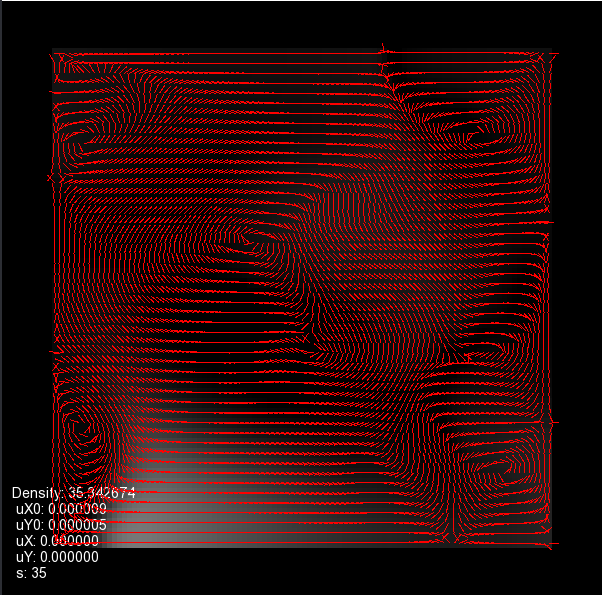
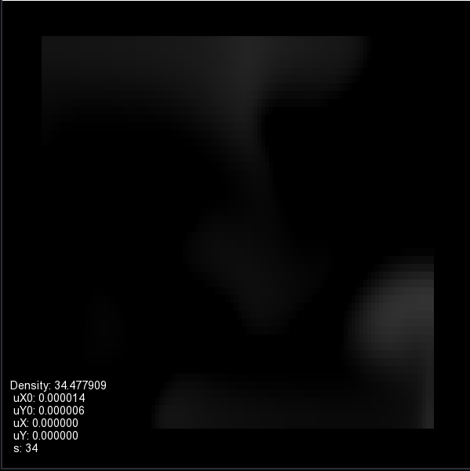
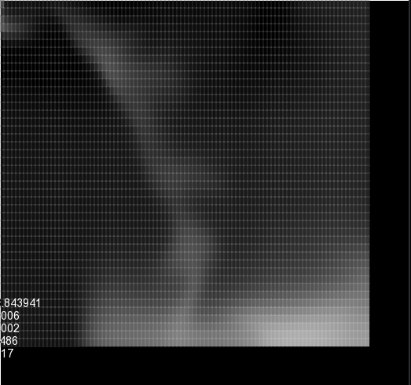

# 2D flow simulation in C++
Program written in C++ using SFML libraries to demonstrate Jos Stam's "Real Time Fluid Dynamics" concepts.

# Prerequisites
* In order to compile this, you need to have SFML installed in your system.

# Compilation
* Run `make build`

# Options:
* Press f to toggle the velocity field
* Press g to toggle view grid
